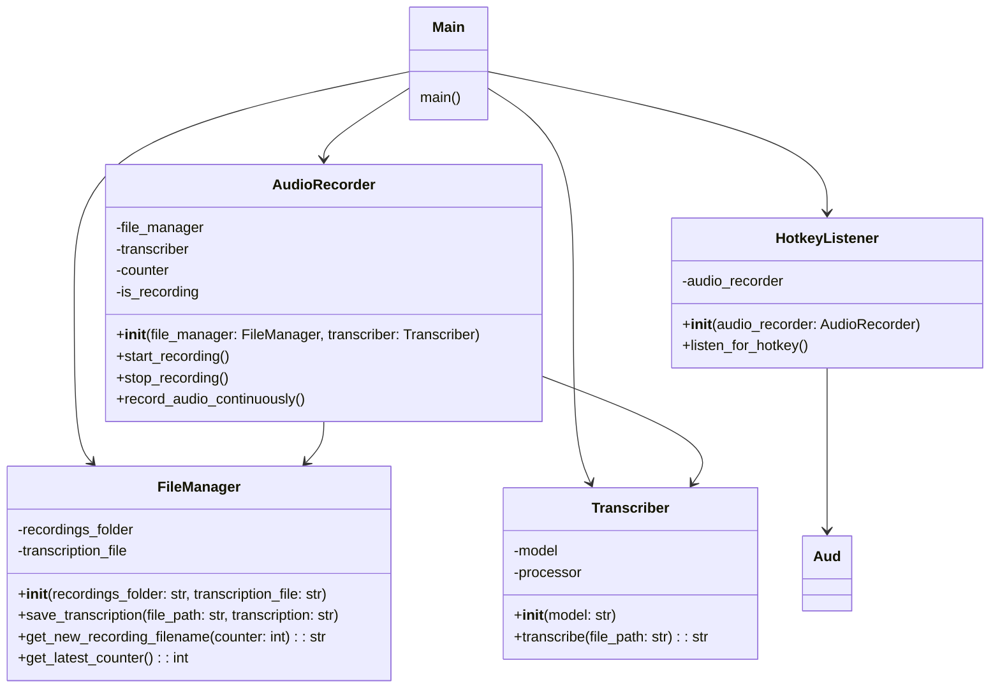

```mermaid
classDiagram
    class Transcriber {
        +__init__(model: str)
        +transcribe(file_path: str) : str
        -model
        -processor
    }

    class FileManager {
        +__init__(recordings_folder: str, transcription_file: str)
        +save_transcription(file_path: str, transcription: str)
        +get_new_recording_filename(counter: int) : str
        +get_latest_counter() : int
        -recordings_folder
        -transcription_file
    }

    class AudioRecorder {
        +__init__(file_manager: FileManager, transcriber: Transcriber)
        +start_recording()
        +stop_recording()
        +record_audio_continuously()
        -file_manager
        -transcriber
        -counter
        -is_recording
    }

    class HotkeyListener {
        +__init__(audio_recorder: AudioRecorder)
        +listen_for_hotkey()
        -audio_recorder
    }

    class Main {
        main()
    }

    Main --> FileManager
    Main --> Transcriber
    Main --> AudioRecorder
    Main --> HotkeyListener

    AudioRecorder --> FileManager
    AudioRecorder --> Transcriber

    HotkeyListener --> Aud
```
